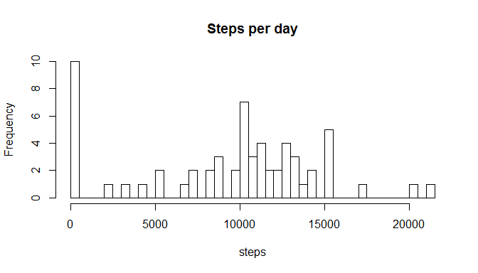
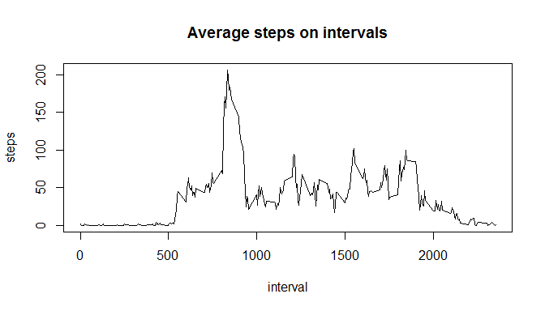
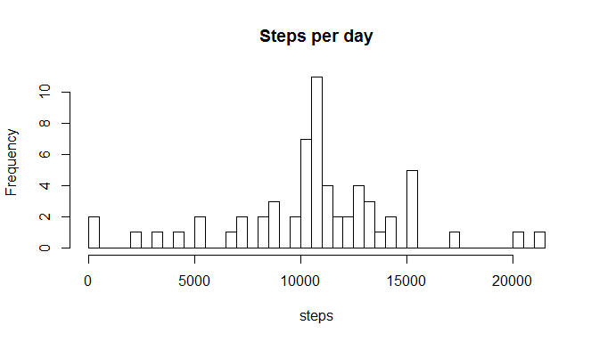
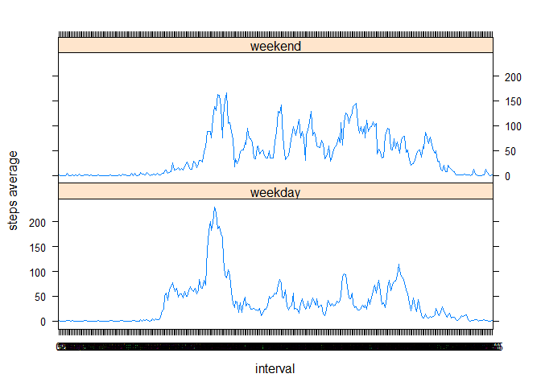

# Reproducible Research: Peer Assessment 1


## Loading and preprocessing the data

First of all unzip the data.


```r
if(!file.exists("activity.csv")){
  unzip("activity.zip")
}
```

Then load the csv data in a dataframe.


```r
rawData <- read.table("activity.csv",sep=",",na.strings="NA",header=TRUE,stringsAsFactors=FALSE)
```

Finally adjust the date to be of type Date, and display a summary to check that everything is fine.


```r
rawData1 <- rawData

rawData1[,2] <- as.Date(rawData1[,2],'%Y-%m-%d')

str(rawData1)
```

```
## 'data.frame':	17568 obs. of  3 variables:
##  $ steps   : int  NA NA NA NA NA NA NA NA NA NA ...
##  $ date    : Date, format: "2012-10-01" "2012-10-01" ...
##  $ interval: int  0 5 10 15 20 25 30 35 40 45 ...
```

## What is mean total number of steps taken per day?


```r
perDay <- split(rawData1, rawData1$date)

stepsPerDay <- data.frame( day = as.Date(character()), stepsNb = numeric(0))

daysNb <- length(perDay)

for( dayNb in 1:daysNb) {
  stepsPerDay[dayNb,1] <- perDay[[dayNb]]$date[1]
  stepsPerDay[dayNb,2] <- sum( perDay[[dayNb]]$steps, na.rm = TRUE)
}

str(stepsPerDay)
```

```
## 'data.frame':	61 obs. of  2 variables:
##  $ day    : Date, format: "2012-10-01" "2012-10-02" ...
##  $ stepsNb: num  0 126 11352 12116 13294 ...
```


```r
hist(stepsPerDay[,2],freq=TRUE,main="Steps per day",xlab="steps",breaks=50)
```




```r
stepsMedian = as.integer(median(stepsPerDay[,2]))
stepsMean = round(mean(stepsPerDay[,2]),2)
```

The median of steps per day is **10395** and the mean of the steps per day is **9354.23**. 

## What is the average daily activity pattern?


```r
#split the data on intervals
rawData2 <- rawData
rawData2[,2] <- as.Date(rawData2[,2],'%Y-%m-%d')
rawData2[,3] <- as.factor(rawData2[,3])
perInterval <- split(rawData2,rawData2$interval)

#initialize the output dataset
averageStepsPerInterval <- data.frame( itv1 = character(0), stepsAverage = numeric(0))
averageStepsPerInterval[,1] <- as.character(averageStepsPerInterval[,1])

#iterate and fullfill the dataset
itvNb <- length(perInterval)
for( i in 1:itvNb) {
  intervalName <- as.character(perInterval[[i]]$interval[1])
  averageStepsPerInterval[i,1] <- intervalName
  averageStepsPerInterval[i,2] <- mean( perInterval[[i]]$steps, na.rm = TRUE)
}

#show a summary to check that everything is ok ...
str(averageStepsPerInterval)
```

```
## 'data.frame':	288 obs. of  2 variables:
##  $ itv1        : chr  "0" "5" "10" "15" ...
##  $ stepsAverage: num  1.717 0.3396 0.1321 0.1509 0.0755 ...
```


```r
x <- averageStepsPerInterval[,1]
y <- averageStepsPerInterval[,2]
plot(x,y,type="l",main="Average steps on intervals",ylab="steps",xlab="interval")
```

 

```r
maxSteps <- max(averageStepsPerInterval[,2])
maxActivityInterval <- averageStepsPerInterval[averageStepsPerInterval[,2]==maxSteps,1]
```

The interval with the maximum numer of steps is **835**.

## Imputing missing values


```r
#calculate NAs
naCount = length( rawData[is.na(rawData$steps), ]$steps )
```
The number of rows with NA values is **2304**.


```r
#initialize the output dataset
noNAData <- data.frame( steps = numeric(0), date = character(0), interval = numeric(0))
noNAData[,2] <- as.character(noNAData[,2])

rdCt = length(rawData$date)

for( r in 1:rdCt ) {
  noNAData[r,2] = rawData[r,2]
  noNAData[r,3] = rawData[r,3]
  if(is.na(rawData[r,1])) {
    istr = as.character(rawData[r,3])
    noNAData[r,1] = as.integer(averageStepsPerInterval[averageStepsPerInterval[,1]==istr,2])
  } else {
    noNAData[r,1] = rawData[r,1]
  }
}

noNAData[,2] <- as.Date(noNAData[,2],'%Y-%m-%d')

str(noNAData)
```

```
## 'data.frame':	17568 obs. of  3 variables:
##  $ steps   : num  1 0 0 0 0 2 0 0 0 1 ...
##  $ date    : Date, format: "2012-10-01" "2012-10-01" ...
##  $ interval: num  0 5 10 15 20 25 30 35 40 45 ...
```


```r
perDay2 <- split(noNAData, noNAData$date)

stepsPerDay2 <- data.frame( day = as.Date(character()), stepsNb = numeric(0))

daysNb <- length(perDay2)

for( dayNb in 1:daysNb) {
  stepsPerDay2[dayNb,1] <- perDay2[[dayNb]]$date[1]
  stepsPerDay2[dayNb,2] <- sum( perDay2[[dayNb]]$steps, na.rm = TRUE)
}

str(stepsPerDay2)
```

```
## 'data.frame':	61 obs. of  2 variables:
##  $ day    : Date, format: "2012-10-01" "2012-10-02" ...
##  $ stepsNb: num  10641 126 11352 12116 13294 ...
```


```r
hist(stepsPerDay2[,2],freq=TRUE,main="Steps per day",xlab="steps",breaks=50)
```




```r
stepsMedian2 = as.integer(median(stepsPerDay2[,2]))
stepsMean2 = format(round(mean(stepsPerDay2[,2]),2),nsmall=2)
```

The median of steps per day for data with no NAs inside is **10641** and the mean, for the same dataset is **10749.77**. 

The values differ from the case when NAs, there are many days with steps different than 0 than before and thus the mean and median increased and also the histogram looks more natural without that odd peek for days with 0 steps.


## Are there differences in activity patterns between weekdays and weekends?

Create the factor weekday and weekend. Name it 'kind'.


```r
sundays = weekdays(noNAData$date) == "Sunday"
saturdays = weekdays(noNAData$date) == "Saturday"
weekendDays = sundays | saturdays
noNAData$kind = "weekday"
noNAData[weekendDays,4] = "weekend"

noNAData$kind = as.factor(noNAData$kind)

str(noNAData)
```

```
## 'data.frame':	17568 obs. of  4 variables:
##  $ steps   : num  1 0 0 0 0 2 0 0 0 1 ...
##  $ date    : Date, format: "2012-10-01" "2012-10-01" ...
##  $ interval: num  0 5 10 15 20 25 30 35 40 45 ...
##  $ kind    : Factor w/ 2 levels "weekday","weekend": 1 1 1 1 1 1 1 1 1 1 ...
```


```r
library(plyr)

noNAData <- transform(noNAData, interval = as.factor(interval) )

twoDS <- split(noNAData, noNAData$kind)
ds1 <- twoDS[[1]][,c(1,3)]
ds1a <- ddply(ds1,.(interval),summarize,sum=mean(steps))
ds1a$kind = "weekday"

ds2 <- twoDS[[2]][,c(1,3)]
ds2a <- ddply(ds2,.(interval),summarize,sum=mean(steps))
ds2a$kind = "weekend"

finalData = rbind(ds1a,ds2a)
finalData <- transform(finalData, kind = as.factor(kind) )

str(finalData)
```

```
## 'data.frame':	576 obs. of  3 variables:
##  $ interval: Factor w/ 288 levels "0","5","10","15",..: 1 2 3 4 5 6 7 8 9 10 ...
##  $ sum     : num  2.1556 0.4 0.1556 0.1778 0.0889 ...
##  $ kind    : Factor w/ 2 levels "weekday","weekend": 1 1 1 1 1 1 1 1 1 1 ...
```

```r
library(lattice)
xyplot(sum ~ interval | kind, type="l", ylab="steps average", data = finalData, layout = c(1,2))
```

 
